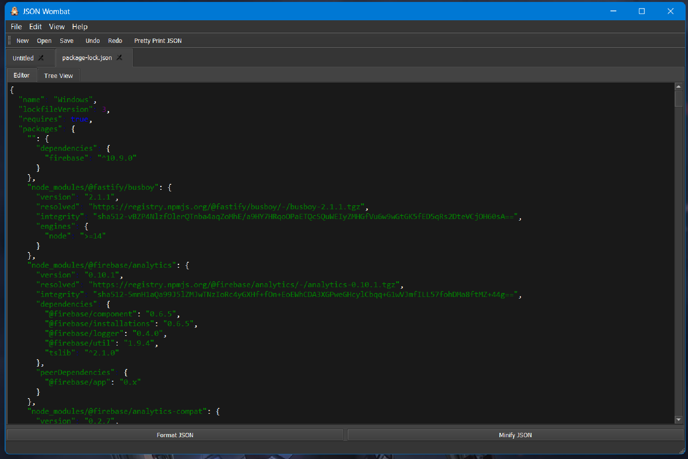
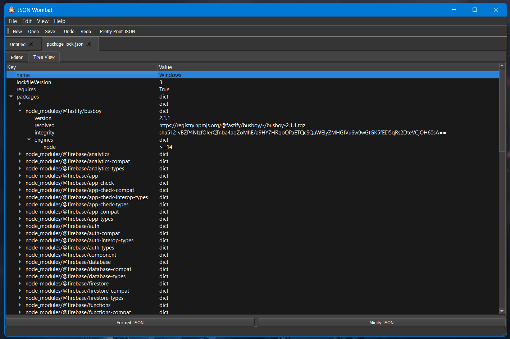

<p align="center">
  <br>
  
</p>

### A Simple Yet Powerful JSON Editor

JSON Wombat is a multi-platform IDE built with Python and PyQt5 for viewing and editing JSON files. It offers a clean interface with essential tools for developers and data analysts who frequently work with JSON data.
## Features

  * **Multi-tabbed Interface**: Open and manage multiple JSON files in a single window.
  * **Syntax Highlighting**: Easily read JSON with color-coded keywords, strings, and numbers.
  * **Pretty Printing & Minifying**: Format ugly JSON for readability or minify it to reduce file size.
  * **JSON Tree View**: Navigate complex JSON structures with a hierarchical tree view. Double-clicking an item in the tree navigates to the corresponding text in the editor.
  * **Dockable Find/Replace**: A powerful, dockable panel for searching and replacing text.
  * **Undo/Redo**: Standard undo (`Ctrl+Z`) and redo (`Ctrl+Y`) functionality.
  * **Light and Dark Themes**: Switch between themes to suit your preference.
  * **Session Management**: The application remembers your open files and theme, restoring your session on startup.
  * **Status Bar**: Provides real-time messages about file operations and status.

<div style="display: flex; gap: 10px;">
  
  
</div>
## Installation

JSON Wombat is a Python application. To run it, you need to have Python and the `PyQt5` library installed.

1.  Clone the repository:
    ```sh
    git clone https://github.com/jones-peter/json-wombat.git
    cd json-wombat
    ```
2.  Install the required library:
    ```sh
    pip install PyQt5
    ```

## Usage

To start the application, simply run the `main.py` file:

```sh
python main.py
```

## Contributing

We welcome contributions\! If you have suggestions for new features, bug reports, or want to contribute code, please feel free to:

  * Open an issue on the [GitHub repository](https://github.com/jones-peter/json-wombat/issues).
  * Fork the repository and submit a pull request.

## License

This project is licensed under the MIT License - see the LICENSE file for details.

## About

JSON Wombat was developed by:

  * **Jones Peter**: [jonespeter.site](https://jonespeter.site)
  * **GitHub**: [jones-peter](https://github.com/jones-peter)
